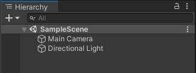
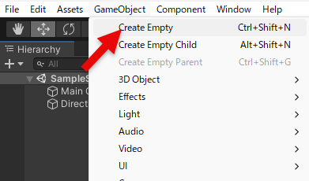
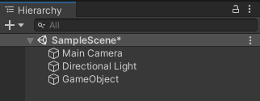
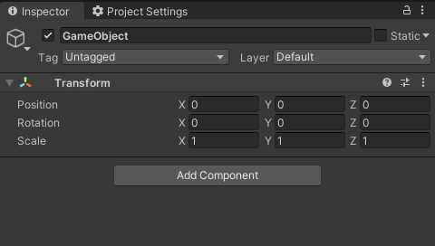
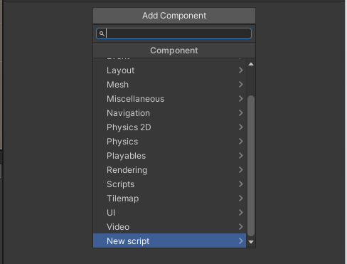
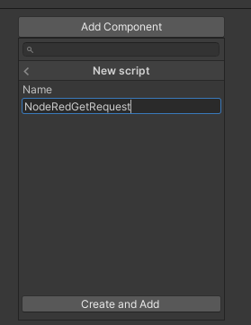
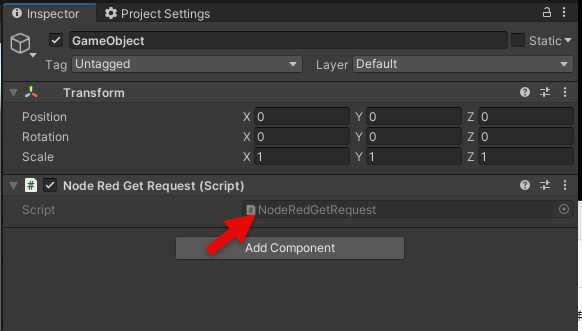
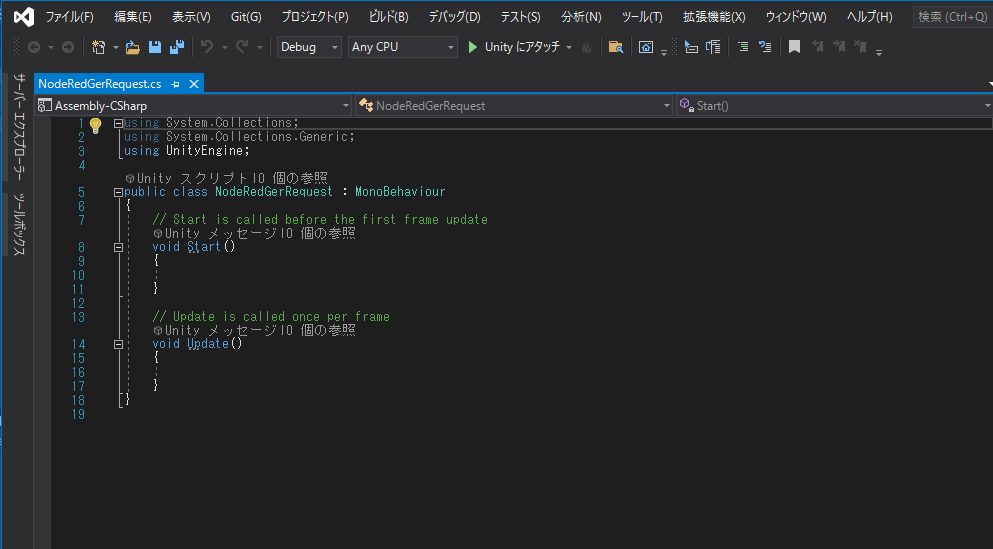

# Node-RED につなぐ Unity プログラムについての設定手順の詳細



Hierarchy を確認します。



Create Empty でオブジェクトを配置します。



Game Object というオブジェクトが作成されます。



Game Object が選択した状態で Inspector を確認して Add Component をクリックします。



New script をクリックします。



Name が聞かれるので NodeRedGetRequest と入力して Create and Add をクリックします。



コンポーネントが追加されたら、C# スクリプトを編集するために、こちらをクリックします。



エディタが起動します。NodeRedGetRequest のスクリプトは以下を記述して保存します。

```csharp
using UnityEngine;

using System.Collections;       // IEnumerator のための参照
using UnityEngine.Networking;   // UnityWebRequest のための参照

public class NodeRedGetRequest : MonoBehaviour
{
    // アクセスする URL
    string urlNodeRED = "ここにサーバーURLを入れる";

    public void Start()
    {
        // HTTP GET リクエストを非同期処理を待つためコルーチンとして呼び出す
        StartCoroutine("GetGitHubData");
    }

    // GET リクエストする本体
    IEnumerator GetGitHubData()
    {
        // HTTP リクエストする(GET メソッド) UnityWebRequest を呼び出し
        // アクセスする先は変数 urlNodeRED で設定
        UnityWebRequest request = UnityWebRequest.Get(urlNodeRED);

        // リクエスト開始
        yield return request.SendWebRequest();

        // 結果によって分岐
        switch (request.result)
        {
            case UnityWebRequest.Result.InProgress:
                Debug.Log("リクエスト中");
                break;

            case UnityWebRequest.Result.Success:
                Debug.Log("リクエスト成功");

                // コンソールに表示
                Debug.Log($"responseData: {request.downloadHandler.text}");
                break;
        }

        request.Dispose();

    }
}
```

保存できたら以下のコードに注目します。

```csharp
    // アクセスする URL
    string urlNodeRED = "ここにサーバーURLを入れる";
```

「ここにサーバーURLを入れる」の部分を、今回の URL http://127.0.0.1:1880/unity/get に変更しておきます。

これで Unity の準備はできました。